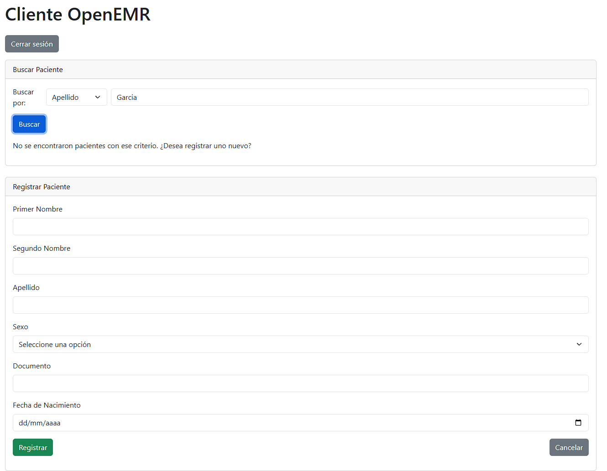

## Cliente API REST para OpenEMR

Primero se debe registrar un cliente similar como esta la imagen

Para obtener JSON Web Key Sets (jwks.json) ir al sitio https://mkjwk.org/,\
Generar set con estos parametros:\
• Key Size: 2048\
• Key Use: Signature\
• Algorithm: RS384:RSA\
• Key ID: SHA-256\
• Show X.509 : Yes\
Elegir Public and Private Keypair Set, agregar ese contenido al archivo jwks.json.\

Ejemplo registro cliente:

Cliente API para OpenEMR. Busca paciente por Apellido o por Documento (pubpid).

Debe ser un usuario con permiso de leer y agregar datos del paciente.

Click en Authorize.

Cliente, elegis Apellido o Documento.

La busqueda no es case sensitive y se puede ingresar parte del texto.

Si el Apellido o Documento no existe, esta la posibilidad de darlo de alta. 

La mayoria del código fue realizado con Grok AI.
